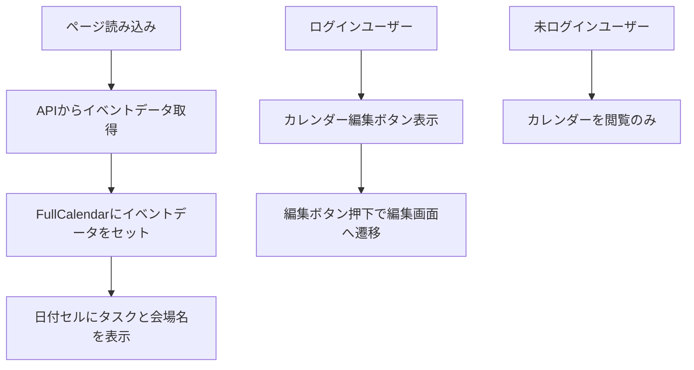

# カレンダー機能実装計画

## 概要
- カレンダーの各日付欄にタスクと会場名を常に表示する。
- ログインユーザーは「カレンダー編集」ボタンを押下して編集画面に遷移可能。
- 未ログインユーザーは操作不要でカレンダーを閲覧し、タスクと会場名を確認可能。

## 処理フロー

## 実装箇所

### フロントエンド
- `templates/index.html`
  - ログイン状態に応じた編集ボタンの表示制御
  - カレンダー表示領域の調整
- `static/js/index_calendar.js`
  - FullCalendarのカスタムレンダリング（`dayCellDidMount`や`eventContent`）で日付セルにタスク・会場名を表示
  - 編集ボタン押下時の画面遷移処理

### バックエンド
- `app.py`
  - `/api/events`のGET APIでタスク・会場名を含むイベントデータを返す
  - `/calendar/manage`の編集画面ルーティング（既存）

### その他
- `models.py`
  - 会場名フィールドの定義確認・必要に応じて拡充

## 注意点
- UI/UXの調整（見やすさ、操作性）
- セキュリティ（編集権限のチェック）

---

この計画をもとに実装を進めます。