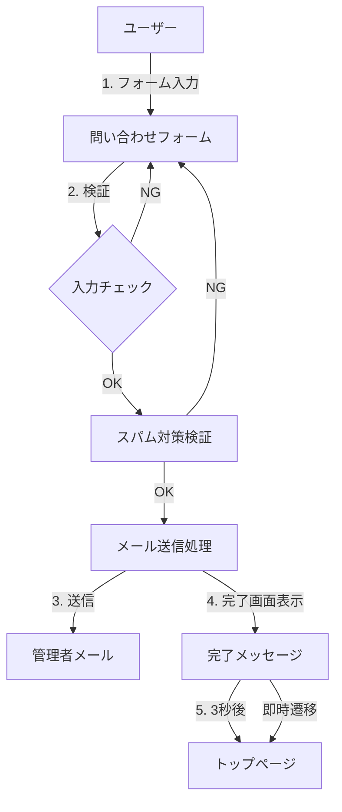

# 問い合わせ機能実装計画

## 1. システム構成図



## 2. 実装コンポーネント

### 2.1 データベース設計
```python
# models.py に追加
class Settings(db.Model):
    id = db.Column(db.Integer, primary_key=True)
    admin_email = db.Column(db.String(120), nullable=False)
    enable_recaptcha = db.Column(db.Boolean, default=True)  # reCAPTCHA の有効/無効設定
    updated_at = db.Column(db.DateTime, default=datetime.utcnow)
```

### 2.2 新規作成ファイル
1. `templates/contact.html` - 問い合わせフォーム
2. `static/js/contact.js` - フォームのバリデーションとreCAPTCHA処理

### 2.3 更新が必要な既存ファイル
1. `templates/admin/venue_manage.html` - 管理者設定セクションを追加
2. `app.py` - 問い合わせ関連のルートとメール送信処理を追加
3. `requirements.txt` - Flask-Mail、reCAPTCHA関連パッケージを追加

### 2.4 機能コンポーネント
1. 問い合わせフォーム
   - 必須項目：メールアドレス、件名、本文
   - 任意項目：名前
   - スパム対策：
     * reCAPTCHA（デフォルトで有効）
     * honeypotフィールド（バックアップとして常時有効）
   - クライアントサイドバリデーション

2. メール送信機能
   - Flask-Mailを使用
   - 管理者メールアドレスをDBから取得
   - エラーハンドリング
   - 送信テンプレート

3. 管理者設定（既存の管理画面に統合）
   - メールアドレス設定/更新機能
   - reCAPTCHA有効/無効切り替え
   - 設定変更履歴の記録

## 3. 実装ステップ

1. 準備フェーズ
   - Flask-Mail、reCAPTCHAのセットアップ
   - Settingsテーブルの作成とマイグレーション
   - 環境変数の設定（MAIL_SERVER、RECAPTCHA_KEYS等）

2. 基本機能実装
   - 問い合わせフォームの作成
   - メール送信機能の実装
   - 完了画面の実装（3秒後自動遷移）

3. セキュリティ対策
   - reCAPTCHAの導入
   - honeypotフィールドの実装
   - サーバーサイドバリデーション
   - CSRF対策

4. 管理機能実装
   - 既存管理画面への設定セクション追加
   - メールアドレス更新機能の実装
   - reCAPTCHA設定の切り替え機能

5. テストとデバッグ
   - 各機能の動作確認
   - セキュリティテスト
   - エラーハンドリングの確認
   - メール送信テスト

## 4. セキュリティ考慮事項
- CSRF対策の実施
- 入力値のサニタイズ
- レート制限の実装
- メールアドレスのバリデーション
- ハニーポットフィールドの実装
- reCAPTCHA検証

## 5. エラーハンドリング
- メール送信失敗時の対応
- バリデーションエラーのユーザーフィードバック
- reCAPTCHA検証失敗時の再試行
- 予期せぬエラー時のログ記録

## 6. 将来の拡張性
- 自動返信メールの実装
- メール送信キューの導入
- 管理者向け通知設定の追加